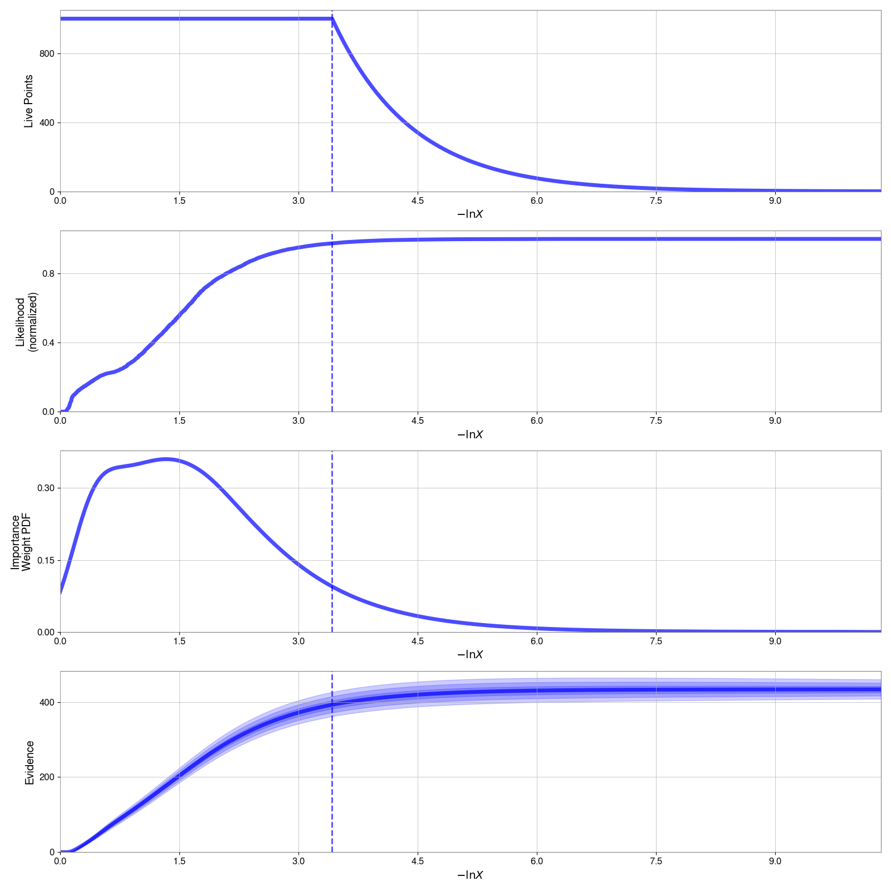
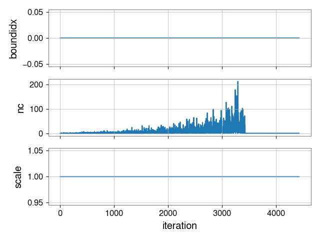

# Getting started with bilby_pipe

This tutorial will go through using `bilby_pipe`, a tool for running analyses
at scale. `bilby_pipe` is not as flexible as `bilby`, but intended to do common
tasks.

## Installation

* `bilby_pipe` is intended for use on either HTCondor or slurm clusters. You
can also use it on a local machine (running jobs serially). If you haven't
already, follow the [installation steps](https://github.com/GregoryAshton/GWParameterEstimationWorkshop2020/blob/master/pages/installation.md) to make sure you have `bilby_pipe`
installed.
* To check it is installed, run
```bash
$ bilby_pipe --version
bilby_pipe=1.0.0 (CLEAN) ....
```

## Dependencies required for remote data access
* `bilby_pipe` uses the `gwpy`, `NDS2`, and `LDASTools-frameCPP` libraries to
  access LIGO-Virgo-KAGRA data. To get full support, these need to be installed
via conda
```bash
$ conda install -c conda-forge python-ldas-tools-framecpp python-nds2-client
```
If you don't install these, remote data access (i.e. not on a LIGO Data Grid
cluster) will be difficult.

## Basics

`bilby_pipe` operates through an `ini` file (also known as a configuration file). The `ini` file specifies **what** to run and **how**. To see all the available options for the `ini` file, you can run

```bash
$ bilby_pipe --help
```

You can also view this output [in the docs](https://lscsoft.docs.ligo.org/bilby_pipe/master/user-interface.html#bilby-pipe-help).

| :rocket: Task: run the `--help` command and check it produces output |
| --- |

## The ini file

An ini file consists of `key=value` pairs, a complete guide can be found [in the docs](https://lscsoft.docs.ligo.org/bilby_pipe/master/ini_file.html), here we will go through an example for a simulated signal.

### Ini file example
```
# The accounting tag, onnly needed on LDG clusters.
# See https://ldas-gridmon.ligo.caltech.edu/accounting/condor_groups/determine_condor_account_group.html
# for help with determining what tag to use
accounting = FILL_THIS_IN

# A label to help us remember what the job was for
label = bbh_injection

# The directory to store results in
outdir = outdir_bbh_injection

# Which detectors to use, option: H1, L1, V1
detectors = [H1, L1]

# The duration of data to analyse in seconds
duration = 4

# The sampler
sampler = dynesty

# The options to pass to the sampler
sampler-kwargs = {'nlive': 1000}

# The prior file to use
prior-file = bbh_simple_example.prior

# We want to inject a signal (in the case, drawn randomly from the prior)
injection = True

# We want to use Gaussian noise (default is to simulate it from O4-design sensitivity curves) 
gaussian-noise = True

# We'll do just one simulation
n-simulation = 1

# We'll run one "parallel" job. This runs n-parallel *identical* jobs and then combines the results together into a single combined run
n-parallel = 1
```
| :rocket: Task: save the contents of the ini file above in a file `bbh_simple_example.ini` |
| --- |

### Prior file
Note, in the ini file, we specified `prior-file = bbh_simple_example.prior`, this is pointing to a file (you can specify and absolute or relative path as needed).
Here are the contents of that file, as you can see, this is a simple prior in only the distance and inclination
```
mass_1 = 50.0
mass_2 = 45.0
a_1 = 0.0
a_2 = 0.0
tilt_1 = 0.0
tilt_2 = 0.0
phi_12 = 0.0
phi_jl = 0.0
luminosity_distance =  bilby.gw.prior.UniformComovingVolume(name='luminosity_distance', minimum=1e2, maximum=5e3, unit='Mpc')
dec = -0.2
ra = 1.4
theta_jn = Sine(name='theta_jn')
psi = 0.0
phase = 0.0
geocent_time = 0.0
```

| :rocket: Task: save the contents of the ini file above in a file `bbh_simple_example.prior`. |
| --- |

### Ini file inputs
In the example above, we see a few different styles of input, let's briefly review them
* `key = value` (e.g, `sampler = dynesty`, `duration=4`, etc)
* `key = list` (e.g. `detectors = [H1, L1]`
* `key = dict` (e.g. `sampler-kwargs = {'nlive': 1000}`) note that the dictionary itself can handle lots of types of input.
* `key = boolean` (.e.g `gaussian-noise = True`)

### Running the example

If you followed the steps above, you should have two files stored `bbh_simple_example.ini` and `bilby_simple_example.prior`. If you do, you can run run bilby_pipe with the command

```bash
$ bilby_pipe bbh_simple_example.ini
```
This will produce the following output:
```
09:37 bilby_pipe INFO    : Running bilby_pipe version: 1.0.0: (CLEAN) e6223de 2020-07-27 17:01:09 -0500
09:37 bilby_pipe INFO    : Running bilby: 1.0.0: release
09:37 bilby_pipe INFO    : Setting segment duration 4.0s
09:37 bilby_pipe INFO    : Setting prior-file to bbh_simple_example.prior
09:37 bilby_pipe INFO    : Setting n_simulation=1
09:37 bilby_pipe INFO    : Using injection file outdir_bbh_injection/data/bbh_injection_injection_file.dat
09:37 bilby_pipe INFO    : Setting analysis request_memory=4.0GB
09:37 bilby_pipe INFO    : Setting request_memory_generation=8GB
09:37 bilby_pipe INFO    : Setting analysis request_cpus = 1
09:37 bilby_pipe INFO    : Using geocent_time prior from prior_file
09:37 bilby_pipe INFO    : Input prior = {
  "mass_1": "DeltaFunction(peak=50.0, name=None, latex_label=None, unit=None)",
  "mass_2": "DeltaFunction(peak=45.0, name=None, latex_label=None, unit=None)",
  "a_1": "DeltaFunction(peak=0.0, name=None, latex_label=None, unit=None)",
  "a_2": "DeltaFunction(peak=0.0, name=None, latex_label=None, unit=None)",
  "tilt_1": "DeltaFunction(peak=0.0, name=None, latex_label=None, unit=None)",
  "tilt_2": "DeltaFunction(peak=0.0, name=None, latex_label=None, unit=None)",
  "phi_12": "DeltaFunction(peak=0.0, name=None, latex_label=None, unit=None)",
  "phi_jl": "DeltaFunction(peak=0.0, name=None, latex_label=None, unit=None)",
  "luminosity_distance": "UniformComovingVolume(minimum=100.0, maximum=5000.0, cosmology=FlatLambdaCDM(name=\"Planck15\", H0=67.7 km / (Mpc s), Om0=0.307, Tcmb0=2.725 K, Neff=3.05, m_nu=[0.   0.   0.06] eV, Ob0=0.0486), name='luminosity_distance', latex_label='$d_L$', unit=Unit(\"Mpc\"), boundary=None)",
  "dec": "DeltaFunction(peak=-0.2, name=None, latex_label=None, unit=None)",
  "ra": "DeltaFunction(peak=1.4, name=None, latex_label=None, unit=None)",
  "theta_jn": "Sine(name='theta_jn', latex_label='$\\\\theta_{JN}$', unit=None, minimum=0, maximum=3.141592653589793, boundary=None)",
  "psi": "DeltaFunction(peak=0.0, name=None, latex_label=None, unit=None)",
  "phase": "DeltaFunction(peak=0.0, name=None, latex_label=None, unit=None)",
  "geocent_time": "DeltaFunction(peak=0.0, name=None, latex_label=None, unit=None)"
}
09:37 bilby_pipe WARNING : File outdir_bbh_injection/bbh_injection_config_complete.ini already exists, not writing to file.
09:37 bilby_pipe INFO    : Setting segment duration 4.0s
09:37 bilby_pipe INFO    : Setting prior-file to /home/user1/GWParameterEstimationWorkshop2020/pipe_examples/bbh_simple_example.prior
09:37 bilby_pipe INFO    : Setting n_simulation=1
09:37 bilby_pipe INFO    : Using injection file outdir_bbh_injection/data/bbh_injection_injection_file.dat
09:37 bilby_pipe INFO    : Setting analysis request_memory=4.0GB
09:37 bilby_pipe INFO    : Setting request_memory_generation=8GB
09:37 bilby_pipe INFO    : Setting analysis request_cpus = 1
09:37 bilby_pipe INFO    : Setting segment trigger-times [0]
09:37 bilby_pipe INFO    : DAG generation complete, to submit jobs run:
  $ condor_submit_dag outdir_bbh_injection/submit/dag_bbh_injection.submit
09:37 bilby_pipe INFO    : Using geocent_time prior from prior_file
09:37 bilby_pipe INFO    : Overview page available at outdir_bbh_injection/results_page/overview.html
```
| :rocket: Task: run  `bilby_pipe bbh_simple_example.ini` and confirm you get output like that above |
| --- |

Note, this has **not** run or submitted the job, only created the files neccersery to do so. You should now see a directory `outdir_bbh_injection` with several sub-directories:
```bash
$ ls outdir_bbh_injection/
data  log_data_analysis  log_data_generation  log_results_page  result  results_page  submit  bbh_injection_config_complete.ini
```
Except the `submit` directory, these will be empty right now and populated one the run starts. Let's look in the `submit` directory
```bash
$ ls outdir_bbh_injection/submit/
bash_bbh_injection.sh  # <- This is a bash file containing all the commands to run different parts of the job locally
bbh_injection_data0_0_analysis_H1L1_dynesty.submit  # <- This is a HTCondor submit file for the analysis step
bbh_injection_data0_0_generation.submit  # <- This is a HTCondor submit file for the analysis step
dag_bbh_injection.submit  # <- This is the HTCondor dag submit file
```

### Submitting the job: HTCondor
If you are running things on a HTCondor cluster, you can now submit the job with
```bash
$ condor_submit_dag outdir_bbh_injection/submit/dag_bbh_injection.submit
```
Alternatively, you can submit things when you run `bilby_pipe` by adding the `--submit` flag, i.e.
```bash
$ bilby_pipe bbh_simple_example.ini --submit
```

### Submitting the job: Slurm
As you'll notice, the **default** in bilby pipe is to use the `HTCondor` scheduler (this is the standard on all LDG clusters). If you are on a Slurm cluster, you need to **add** some lines to the ini file, a detailed discussion of these can be found [in the documentation](https://lscsoft.docs.ligo.org/bilby_pipe/1.0.1/user-interface.html#using-the-slurm-batch-scheduler), but will depend on your cluster setup.

### Submitting the job: local
All bilby_pipe jobs can be run on your local machine. There are two ways to do this
#### 1. Using the `--local` flag
You can run 
```
$ bilby_pipe bbh_simple_example.ini --local
```
This will run each step of the job sequentially on your local machine
#### 2. Using the bash file
Let's look inside the `bash` file
```bash
$ cat outdir_bbh_injection/submit/bash_bbh_injection.sh 
#!/usr/bin/env bash

# bbh_injection_data0_0_generation
# PARENTS 
# CHILDREN bbh_injection_data0_0_analysis_H1L1_dynesty
/home/user1/anaconda3/envs/bilby/bin/bilby_pipe_generation outdir_bbh_injection/bbh_injection_config_complete.ini --label bbh_injection_data0_0_generation --idx 0 --trigger-time 0 --injection-file outdir_bbh_injection/data/bbh_injection_injection_file.dat

# bbh_injection_data0_0_analysis_H1L1_dynesty
# PARENTS bbh_injection_data0_0_generation
# CHILDREN 
/home/user1/anaconda3/envs/bilby/bin/bilby_pipe_analysis outdir_bbh_injection/bbh_injection_config_complete.ini --outdir outdir_bbh_injection --detectors H1 --detectors L1 --label bbh_injection_data0_0_analysis_H1L1_dynesty --data-dump-file outdir_bbh_injection/data/bbh_injection_data0_0_generation_data_dump.pickle --sampler dynesty
```
This contains the set of instructions to run each step of the job. You can run this directly, i.e. with
```bash
$ bash outdir_bbh_injection/submit/bash_bbh_injection.sh
```
Or you can copy parts of the file you want to run to a separate script and run each one individually (this is often very useful if you **just** want to run a step locally, i.e. the plotting).
| :rocket: Task: the example script using *either* the `--local` flag or the bash file |
| --- |

### Looking at the outputs
Once you have run the example to completion, we should check the outputs. If you ran using either `slurm` or `HTCondor` the `log*` files will be populated with files containing the run outputs. If instead you ran it locally, this output would have been printed to the terminal.

In the `results` directory, is stored all of the relevant output:
```bash
$ ls outdir_bbh_injection/result
bbh_injection_data0_0_analysis_H1L1_dynesty_result.json  # <- THIS IS THE MAIN RESULT FILE
bbh_injection_data0_0_analysis_H1L1_dynesty_dynesty.pickle  # <- A python pickle file of the dynesty sampler output
bbh_injection_data0_0_analysis_H1L1_dynesty_resume.pickle  # <- A python pickle file used to store results during the run
bbh_injection_data0_0_analysis_H1L1_dynesty_samples.dat  # <- A set of samples created during the run, not the final output
bbh_injection_data0_0_analysis_H1L1_dynesty_checkpoint_run.png 
bbh_injection_data0_0_analysis_H1L1_dynesty_checkpoint_stats.png
bbh_injection_data0_0_analysis_H1L1_dynesty_checkpoint_trace.png
```
The last three `png` images contain diagnostic plots. These will be updated during the run and help show the progress

#### The run plot
Shows the [dynesty summary plot](https://dynesty.readthedocs.io/en/latest/quickstart.html#summary-plots)


#### The stats plot
This is a plot of the number of calls and the scale parameter for nested sampling proposals (for this short run, it is a little uninteresting)


#### The trace plot
Shows the [dynesty trace plot](https://dynesty.readthedocs.io/en/latest/quickstart.html#trace-plots). The right-hand side are the 1D posteriors

