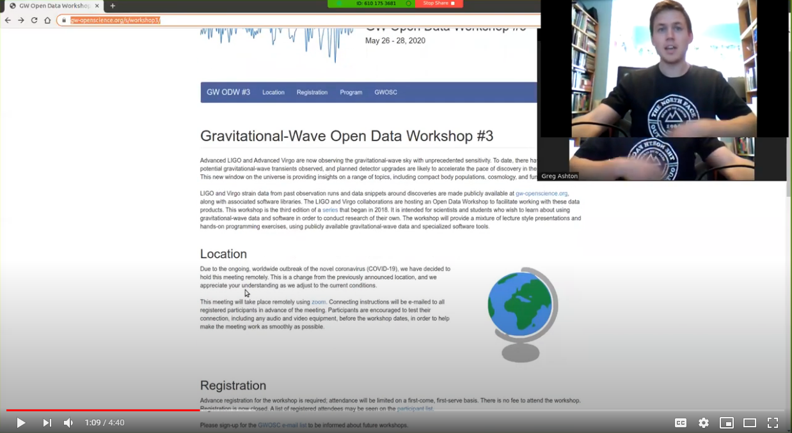
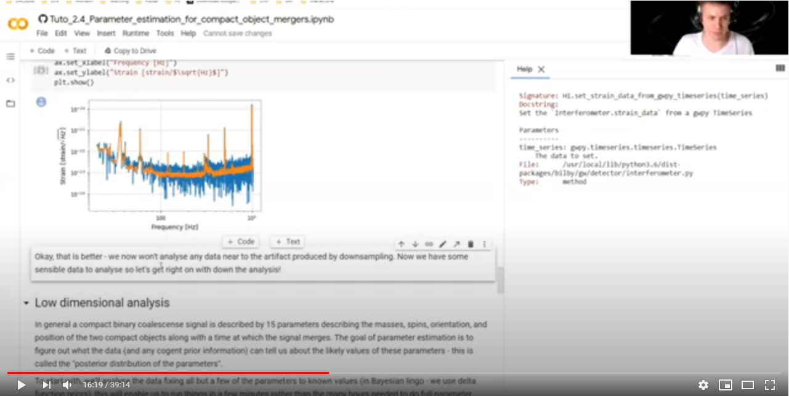

# Gravitational-Wave Open Data Workshop

In May 2020, the LIGO-Virgo collaborations hosted [the third Gravitational-Wave Open Data Workshop](https://www.gw-openscience.org/s/workshop3/)
This is a fantastic series which provides a rich set of worked tutorials on all aspects of GW data analysis, from [obtaining data](https://github.com/gw-odw/odw-2020/blob/master/Day_1/Tuto%201.2%20Open%20Data%20access%20with%20GWpy.ipynb) to performing [consistency tests](https://github.com/gw-odw/odw-2020/blob/master/Day_2/Tuto_2.3_Signal_consistency_and_significance.ipynb) and much more.

In this series of videos, I'll go through [tutorial 2.4](https://github.com/gw-odw/odw-2020/blob/master/Day_2/Tuto_2.4_Parameter_estimation_for_compact_object_mergers.ipynb) which covers parameter estimation of compact binary mergers.
This introduces many of the concepts we'll see elsewhere and, if you are not yet familiar with bilby, some of the specifics of bilby data analysis.

## Useful Links
* [GW-ODW main page](https://www.gw-openscience.org/s/workshop3/)
* [ODE-2020 Tutorial 2.4](https://github.com/gw-odw/odw-2020/blob/master/Day_2/Tuto_2.4_Parameter_estimation_for_compact_object_mergers.ipynb)
* [Google Colab](https://colab.research.google.com/)

## Getting set up

(I apologize that zoom put two cameras on the screen making it seem like I have two sets of arms!)
This [video](https://youtu.be/D5mkFydbMso) goes through getting set up with a jupyter notebook containing the needed code. 

## Walk through of the tutorial
This [video](https://youtu.be/MQ8H-2AIzKQ) walks through the tutorial, covering downloading data, and running a simple analysis

