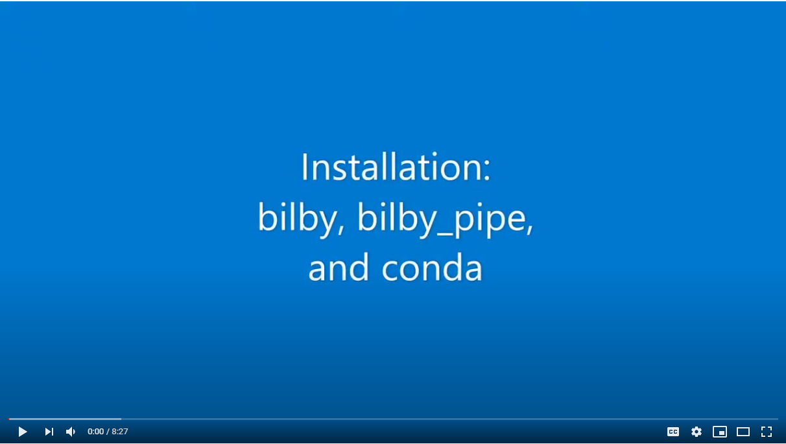

# Installation

To get started, you'll need to install the bilby and bilby_pipe software.

## Video

Here is a video (click the image) which takes you through the installation process step by step

<a href=https://youtu.be/hpf14HnWIYw>  </a>

## Links

Here are some useful links to see for details of the installation process

* bilby: https://git.ligo.org/lscsoft/bilby
* bilby_pipe: https://git.ligo.org/lscsoft/bilby_pipe
* anaconda: https://www.anaconda.com/products/individual
* anaconda environments: https://docs.conda.io/projects/conda/en/latest/user-guide/tasks/manage-environments.html

## Check you are setup

To check that your setup works, run the following line. If you get some output, then you are good to go!

```
$ bilby_pipe --version
bilby_pipe=0.3.12: (CLEAN) 4b6a4c3 2020-07-30 15:13:57 +1000 bilby=1.0.0:
release
```
